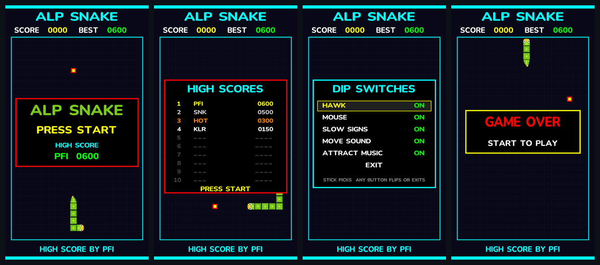
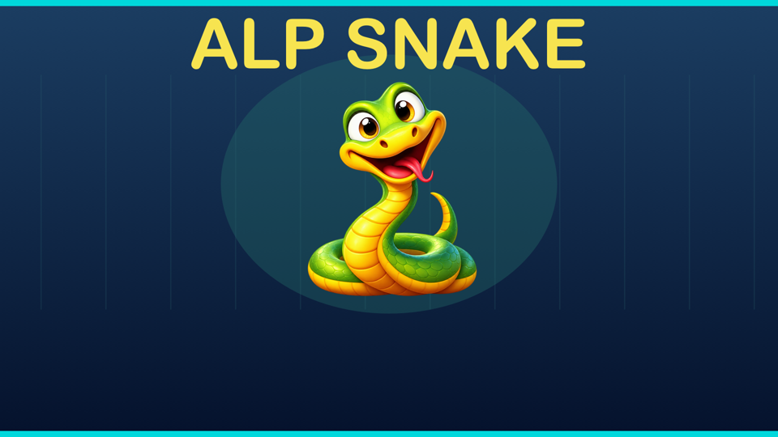

# alpSnake

An original, dual-screen Snake game and small build example for the **original
AtGames Legends Pinball HD**. It runs as a traditional BYOG AddOn UCE. The
playfield is a custom AArch64 libretro core; a separate SDL2 helper renders a
live score and original mascot artwork on the backglass. It uses the cabinet's
normal Retroplayer launcher and does not require a game ROM, firmware change,
root access, or AddOnX.

This is a homebrew example developed on an original ALP HD running firmware
5.70.0, not a claim of compatibility with every ALP model or firmware.

It uses only the cabinet's normal BYOG → AddOn feature: no firmware changes,
no root access, no exploits, and no AtGames code, artwork or ROMs in the
package. AtGames publishes no developer guide for AddOns; see
[DEVELOPER.md](DEVELOPER.md#where-this-knowledge-came-from) for the public
sources this project is built on.





*Playfield images are rendered by the test suite (`tests/run_tests.sh`), not
photographed.*

## Play

| Cabinet control | Game action |
| --- | --- |
| Joystick | Steer |
| Trackball | Roll in the desired direction |
| Left / right flipper | Turn left / right relative to travel |
| Start | Start, pause/resume, or restart after game over |
| Cabinet Menu | Exit AddOn or select **Display Mode → Fill** |

Turns are buffered up to two moves ahead and take effect on regular movement
ticks paced by the cabinet's monotonic clock, not the number of Retroplayer
frames. The game starts at 7.5 cells per second and speeds up as the score grows.

Every 10–20 seconds a mouse scurries in from an edge and runs for the other
side, jinking now and then and dodging around the snake. It moves at about
two-thirds of the snake's speed, so it can be headed off but not chased down.
Catching it is worth 20 points (food is worth 10) and shrinks the snake by
three segments, never below its starting four, so skilled players can keep a
game going far longer. Scores show five digits once they pass 9999. Speed rises
one step every five foods; mice never speed the snake up.

Once the snake has sped up, a yellow SLOW road sign occasionally appears in an
empty square for about 70 moves, blinking before it vanishes. Eating it drops
the snake back one speed step, and the next speed-up then needs five more
foods.

Rarest of all is the hawk, about once every minute or two. A screech warns it
has arrived and its shadow circles the snake for a few seconds. Then it locks
on to where the head is heading: a flashing red 3×3 target appears ahead of
the snake and the shadow grows as the hawk drops. If the head is inside the
target when it strikes, about a second later, the hawk carries the snake off
and the game ends; turn away and it misses, for a 50-point bonus. The warning
lasts about the same real time at every speed.

The game synthesizes its own stereo sound (`src/snake_audio.c`): a soft
"waka" on every move, plus sounds for starting, eating, pausing, crashing, and
winning. Sounds are panned to follow the snake's head across the board and pass
through a light ping-pong echo.

Scores update on the backglass while the game runs. The game keeps a top-ten
table, seeded with four sample scores (PFI, SNK, HOT, KLR). Any score that makes
the table opens arcade-style initials entry: the stick or trackball changes a
letter, left/right or the flippers move between letters, and Start (or the
right flipper on the last letter) saves. A new number one also gets confetti
on the playfield and backglass and a fanfare. The table appears on the attract
screen and is saved in the UCE's writable save area; older saves with a single
best score are carried into it.

### Attract mode

At launch, and eight seconds after a game ends, the game shows an attract
screen: a computer-played demo snake chases food and mice in the background
while a box cycles through the title (PRESS START and the high score), the
top-ten table and a how-to-play page. An original Egyptian-trap tune in E Hijaz plays, written
for the game's own synthesizer (`src/snake_audio.c`): a mizmar-style lead, oud
plucks, darbuka, claps, rolling hi-hats and an 808. Start begins a game and
the music fades out.

### Options (DIP switches)

ALP Snake presents itself to Retroplayer like the cabinet's MAME 2003-Plus
AddOns (core file name, library name and its standard settings), which makes
the cabinet menu offer its arcade entries: **Insert Coin** starts a game and
**Adv. Config** opens ALP Snake's
own DIP SWITCHES page. (Save states aren't supported; the cabinet's Save
Slots don't work for its MAME games either.) On that page the stick picks a switch and a flipper,
left/right or Start flips it: **Hawk**, **Mouse**, **Slow signs**, **Move
sound** and **Attract music** (all On by default). A game in progress pauses
while the page is open. Settings are saved in the UCE's save area
(`save/settings.dat`) and apply immediately.

How it works: Adv. Config switches the `mame2003-plus_display_setup` setting
to "enabled" (and back when the menu closes), which is what makes MAME draw its
own menu. Retroplayer also restarts the game as the menu closes; ALP Snake
ignores that restart so a game is never lost to it.

Hold both flippers on the attract, Ready or Game Over screen for a readout of
the measured frame rate, how much sound the cabinet accepted, and the slowest
frame and redraw of the last two seconds.

`build-probe-and-copy.command` builds a separate diagnostic UCE that logs what
Retroplayer does to the game into its save area (`save/probe.log`).

## How it works

Want to build your own game for the cabinet? Read [DEVELOPER.md](DEVELOPER.md),
a developer's guide to everything this project learned (UCE format, timing,
sound, the backglass, the cabinet menu), then the commented source.

- `src/snake_game.c` contains the game rules, independent of ALP hardware.
- `src/snake_libretro.c` provides a 1080 × 1920 RGB565 video frame, cabinet
  controls, trackball input, and 44.1 kHz stereo audio to Retroplayer. It draws
  into alternating framebuffers so Retroplayer sees a completed frame.
- `src/snake_backglass.c` creates an SDL2 window on the backglass display.
  The core sends score state through an atomically replaced file under `/tmp`.
  The helper closes when the game removes its state file; pausing Retroplayer
  does not terminate the backglass display.
- `tools/make_*.swift` generates BYOG box art and backglass art. The bundled
  smooth font atlas is generated only when the font changes. `tools/build.py`
  compiles the two AArch64 programs and
  `tools/package_uce.py` packages a self-contained UCE. `roms/snake.zip` in the
  package is only a small text placeholder to start Retroplayer, **not a ROM**.
- `tools/sdl2_link_stub.c` provides symbol names to the linker on the build
  computer. It is never included in the UCE or run on the cabinet. At runtime,
  the game uses the cabinet's installed `libSDL2-2.0.so.0`.

The core opens the first input device reporting relative X/Y motion read-only.
No input device settings are changed. The backglass helper uses the SDL display
path observed on the original ALP HD; it does not take DRM master or alter the
system display configuration.

## Build on macOS

Install Xcode command-line tools and the build dependencies:

```sh
brew install llvm lld squashfs e2fsprogs
```

From the project directory, run:

```sh
cd ~/Projects/alpSnake
./build.sh
```

The script checks prerequisites and tells you what is missing; it does not
install software or download a library. You **do not need to obtain SDL2** for
this build. An AArch64 link-only stub is generated locally, while the UCE uses
the SDL2 already installed on the ALP HD. The stub is never packaged. SDL2
itself is [open-source software](https://www.libsdl.org/license.php); the
cabinet's build has display behavior that standard desktop SDL2 may not have.
An owned cabinet is still needed to run and verify the game.

The build uses the included `include/libretro.h` and pre-rendered Nunito font
atlas. It does **not** regenerate the font on each build. The scripts ask
`brew --prefix` where LLVM, lld, and e2fsprogs are installed; they do not
assume an Apple Silicon or Intel Homebrew prefix. `CLANG` and `LINKER` can
override tool discovery if necessary. Developers can set `SDL2_LINK_LIBRARY`
to a compatible AArch64 **Linux** SDL2 library for stricter link-time checks;
macOS Homebrew SDL2 is not suitable. The result is
`dist/ALP-Snake.UCE`. Build intermediates stay in `build/`; both folders
are gitignored. The packaging script uses `mksquashfs`, `mke2fs`, and
`debugfs` to create the AddOn filesystem and save area. It packages only this
game. The UCE layout follows the community's public documentation (credited in
[DEVELOPER.md](DEVELOPER.md#where-this-knowledge-came-from)).

To change the font, edit or replace `assets/Nunito-wght.ttf`, then explicitly
regenerate and retain the atlas:

```sh
swift tools/make_smooth_font.swift assets/Nunito-wght.ttf assets/snake-font.bin
```

`assets/snake-font.bin` is tracked source material, not a build intermediate.

## Test without the cabinet

```sh
tests/run_tests.sh
```

Runs the rules fuzzers (random games, hawk scenarios, SLOW signs and speed
levels) and the whole core inside a fake Retroplayer, with address and
undefined-behaviour sanitizers. It works on macOS or Linux with any C
compiler and writes screenshots to `tests/out/`. See
[DEVELOPER.md](DEVELOPER.md#13-testing-without-the-cabinet).

## Install on the cabinet

1. Use an existing FAT32 AddOn USB drive, or format a spare drive as one
   **MBR/FAT32** volume. Formatting erases it.
2. Copy `dist/ALP-Snake.UCE` to the **root** of the drive.
3. Eject the drive on the Mac, insert it in the pinball cabinet, and open
   **BYOG → AddOn → ALP Snake**.
4. The centered mode can show the cabinet's blue streak background around the
   game through a transparent bezel. If you prefer the game to fill the
   playfield, select **Display Mode → Fill** in the cabinet menu. This setting
   may need to be selected again on the next launch.

The default-mode bands are outside the game's libretro video rectangle; the
core cannot paint them. The bundled transparent bezel restores the earlier
centered-view appearance on the tested cabinet; it does not make the game
fullscreen or provide a reliable automatic Fill setting. Its appearance may
vary with firmware.

## Source and licenses

The original game code, build scripts, and generated mascot artwork in this
repository are offered under [MIT](LICENSE). The included Nunito font is
licensed separately under [SIL OFL 1.1](assets/OFL-Nunito.txt). The included
`include/libretro.h` carries its own permissive license notice in the file.
The mascot was AI-generated for this game and is not copied from an existing
game. No Gridlee or other game ROM, stock AtGames artwork, firmware image, or
proprietary SDL2 binary is included.

## Trademarks and disclaimer

ALP Snake is an independent, unofficial fan project. It is **not affiliated
with, endorsed by, sponsored by or supported by AtGames** or any other company
named here.

- AtGames, Legends Pinball, Legends Ultimate, Legends Arcade, BYOG, AddOn,
  AddOnX and ArcadeNet are trademarks of AtGames Digital Media, Inc. or its
  affiliates. The cabinet's firmware, Retroplayer and all AtGames software and
  artwork are © AtGames and its licensors.
- MAME is a trademark of the MAME project. "MAME 2003-Plus" is the name of an
  open-source libretro core; ALP Snake reports that name only so the
  cabinet's menu works with it (see DEVELOPER.md), and contains no MAME code.
- libretro is a trademark of its respective owners. SDL is © Sam Lantinga and
  is used only as already installed on the cabinet. Pac-Man is a trademark of
  Bandai Namco Entertainment Inc.; it is mentioned only to describe a sound
  style, and ALP Snake contains nothing from it. CoinOpsX and RetroFE belong
  to their respective authors.
- Other names and marks belong to their respective owners and are used only to
  identify them, under nominative fair use.

The software is provided "as is", without warranty of any kind (see
[LICENSE](LICENSE)). Installing homebrew on your cabinet is done at your own
risk; the authors are not responsible for any damage, data loss, or effect on
your warranty or service. This notice is not legal advice.

## Limitations

- The backglass method and eDP connector selection are hardware-specific.
- The SDL2 link stub verifies symbol names, not runtime behavior; cabinet
  validation remains necessary after SDL-related changes.
- Replacing the UCE with a freshly built file resets its embedded save area,
  including the best score. Keep a copy of the existing UCE if that matters.
- The idle keepalive was tested briefly, not as a long-duration guarantee.
- Always exit through the cabinet menu before removing the USB drive.
